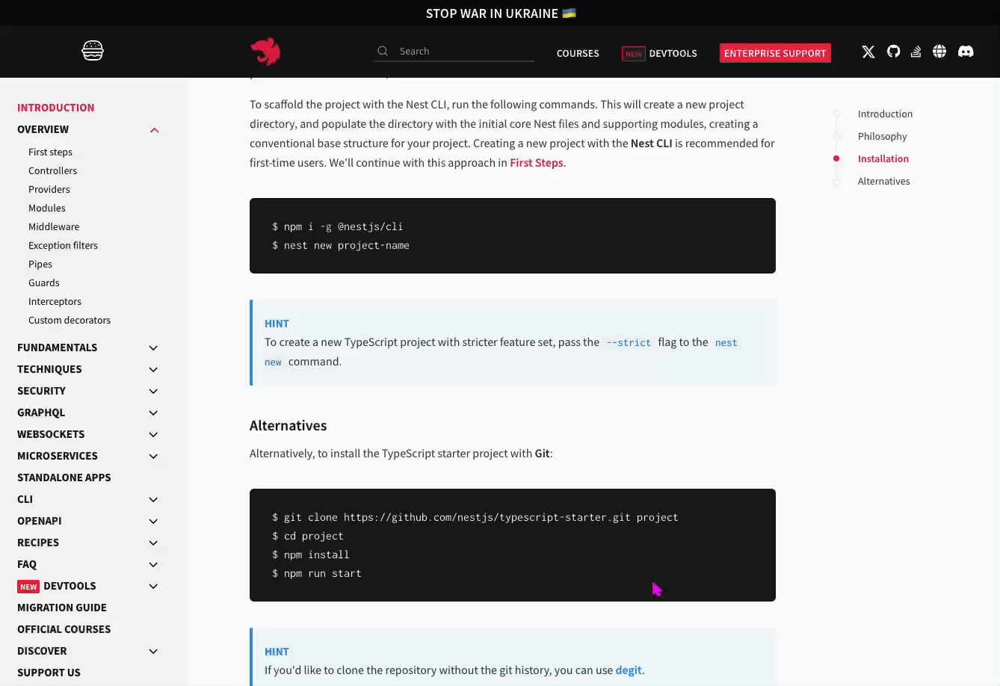
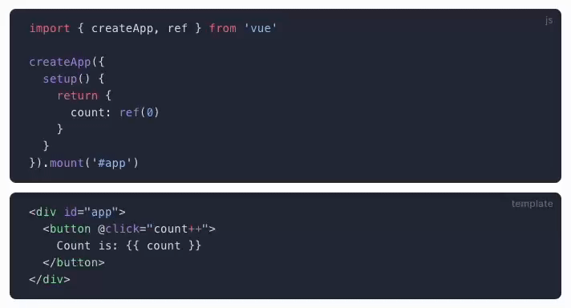

# E-ink Improvement for Chrome

This is a Chrome extension to improve the websites shown in e-ink displays.

The main idea is to convert dark themes to light themes.

## Install

1. Clone the source code.

2. Run `pnpm i` and `pnpm build`.

3. Open `chrome://extensions` in Chrome.

4. Enable `Developer mode`.

5. Click the `Load unpacked` button and choose the `dist` folder.

## Usage

- ink style

  

  - Click the `Apply/Remove ink style` button in the extension popup or use the shortcut `<Ctrl-Shift-E>` to toggle it.

  - Once applied, the ink style will be applied to all tabs with the same host. The extension will write down the hosts.

    - Click the `Clear storage` button to clear the hosts.

  - It will iterate all document nodes, analyze their background color, and then add an inline style for each needed node.

- code block style

  

  - Click the `Apply code block style` checkbox in the extension popup or use the shortcut `<Ctrl-Shift-I`>` to toggle it.

  - The style will work on all tabs if you keep the checkbox checked.

  - Just add a style tag to make the background of the code block white and the text black.

The best practice is to keep the `Apply code block style` checkbox checked and use ink Style only when needed.

## Thanks

This project is heavily inspired by the following awesome project.

- [ismartcoding/e-ink-viewable](https://github.com/ismartcoding/e-ink-viewable).

## License

[MIT License](https://github.com/hui890514/chrome-e-ink-improvement/blob/main/LICENSE) © 2024-PRESENT [慧](https://github.com/hui890514)
