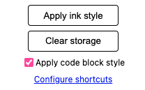

# E-ink Improvement for Chrome

This is a Chrome extension to improve the websites shown in e-ink displays.

The main idea is to convert dark themes to light themes, and more, I will do some custom works for some frequently visited websites.

## Install

1. Clone the source code.

2. Open `chrome://extensions` in Chrome.

3. Enable `Developer mode`.

4. Click the `Load unpacked` button and choose the `src` folder.

## Usage

- You can click the extension icon on the right of the URL bar to open the popup above, then click the `Apply ink style` button. The ink style will be added to the current tab, then you can click the `remove ink style` button to remove the ink style.

  - You can also use the shortcut(`<Ctrl-Shift-E>`) to toggle it.

  - It's important to note that when you apply the ink style on a tab, the extension will remember the website host, so when you open the same host website afterward, the ink style will be automatically applied. You don't need to apply it twice(remove ink style is similar). But if you open the website with a different host, you should click the `Apply ink style` button again.

- You can click the button `Clear storage` in the popup to clear the remembered website, then all websites opened after will not use the ink style until you click the `Apply ink style` button again.

- In my experience, most websites we visit using e-ink displays are technical documentation or blogs, and most of them use a light theme so we can read them easily without any extension. Only the code block is different, they are always using a dark theme and we cannot read the code directly. In this situation, we don't need to convert the whole website, so I added the `Apply code block style` checkbox to solve this problem. This option will just add a style tag to make the background of the code block white and the text black.

  - Unlike the `Apply ink style` button, this option will work on all tabs if you keep the checkbox checked.

  - This option has higher performance because it just adds a style tag to the web. Otherwise, `Apply ink style` will iterate all nodes, analyze their background color, and then add an inline style for each needed node.

  - You can also use the shortcut(`<Ctrl-Shift-I>`) to toggle it.

## Thanks

This project is heavily inspired by the following awesome project.

- [ismartcoding/e-ink-viewable](https://github.com/ismartcoding/e-ink-viewable).

## License

[MIT License](https://github.com/hui890514/chrome-e-ink-improvement/blob/main/LICENSE) © 2024-PRESENT [慧](https://github.com/hui890514)
